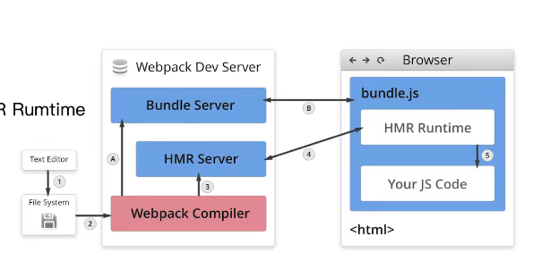

## Loader

**file-loader & url-loader**
- 都可以用于处理文件 比如字体文件，图片
- url-loader可以设置较小资源自动 base64

## Plugin

## webpack热更新及原理分析

**webpack-dev-server** 

- WDS 不刷新浏览器
- WDS 不输出文件（没有磁盘的I/O），而是放在内存中
- 使用HotModuleReplacementPlugin插件

**webpack-dev-middleware**

- WDM将webpack输出的文件传输给服务器
-  适应于灵活的配置场景

**原理分析**

webpack Compile：将JS编译成Bundle

HMR Server： 将热更新的文件传输给 HMR Runtime

Bundle server：提供文件在浏览器的访问

HMR Runtime: 会被注入到浏览器，更新文件的变化

bundle.js：构建输出的文件

## 文件指纹 

- 打包后出现的文件名的后缀

**chunkhash**：和webpack打包的chunk有关，不同的entry会生成的不同的chunkhash值

**contenthash**：根据文件内容来定义hash，文件内容不变，则contenthash不变

**hash**：和整个项目的构建相关，只要项目文件有修改，整个项目构建的hash值就会更改

## 文件压缩

**js压缩**: 内置了uglifyjs-webpack-plugin，js文件默认是压缩的

**css压缩**：optimize-css-assets-webpack-plugin，同时使用cssnano

**html文件的压缩**： html-webpack-plugin,设置压缩参数

## 自动清理构建目录产物

**clean-webpack-plugin**
- 默认会删除output指定的输出目录

## 自动补全自动补全CSS前缀

- 使用 PostCSS 插件 autoprefixer 插件自动补全CSS3前缀

## 移动端将PX转为rem

- lib-flexible.js
- px2rem插件

## 资源内联

**raw-loader**